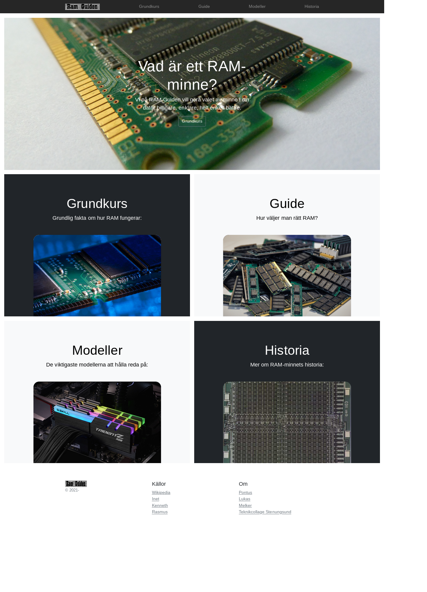

<header style="float:right;">
  
</header>

# Webbutveckling 1: Webbprojekt 1

*Ni har tidigare lärt er hur man bygger en webbplats med hjälp av HTML och CSS. Dessutom vet ni både hur man planerar för och samarbetar kring ett projekt. Tillsammans med kunskaper om ramverk som Bootstrap och andra hjälpmedel som finns på nätet så skall ni nu omsätta denna kunskapen i praktiken.*

---

## Förutsättningar

Gruppuppgift för 3-4 personer.

## Resurser
* [HTML Dog](https://htmldog.com/)
* [Bootstrap](https://getbootstrap.com/)

> Tips! Skapa och länka in tre CSS-dokument; ett för layout, ett för typografi och ett för färgsättning. Så ni har dem separerade från varandra. Detta gör det lättare att samarbeta.

## Uppgiftsbeskrivning

Detta projekt kommer att löpa under hela våren, men är uppdelad i tre större moment, planering (\~4 veckor), konstruktion (\~6 veckor) och verifiering (\~4 veckor). Påbörja inte nästa moment förän ni slutfört och lämnat in föregående moment. Målsättningen med projektet är att ni skall lära er att använda och tillämpa andras kod (både Bootstraps och era gruppkamraters), att identifiera och hantera problem som kan uppstå när man arbetar med mjukvaruutveckling i grupp samt de punkter från Skolverket ni kan läsa citerat nedan.

> Skolverket centrala innehåll säger att ni i kursen Webbutveckling 1 skall lära er:
> * Processen för ett webbutvecklingsprojekt med målsättningar, planering, specifikation av struktur och design, kodning, optimering, testning, dokumentation och uppföljning.
> * Applikationer som fungerar oberoende av val av användaragent, operativsystem eller hårdvaruplattform och hur tillgänglighet uppnås även för användare med funktionsnedsättning.
> * Kvalitetssäkring av applikationens funktion och validering av kodens kvalitet."

### Planering

* Definiera, beskriv och förklara webbplatsens buisness objectives
* Skapa en moodboard
* Skapa en sitemap
* Definiera Call To Actions för varje undersida
* Bestäm ett färgschema för webbplatsen
* Undersök vad Bootstrap kräver
* Diskutera hur logotypen skulle kunna se ut
* Skapa en genomtänkt katalogstruktur och skapa alla filer ni behöver
* Fyll alla filer med Lorem Ipsum så ni har något att arbeta med
* Skall ni ha sociala medier på sidan? Som Twitter/Facebook/Identi.ca/Flickr/... ... ... ?
* Finns det andra tjänster (widgets) som skulle göra sidan bättre?
* Skapa relevanta wireframes (en för förstasidan, en för varje typ av undersida, samt varianter för plattor och mobiler)

### Konstruktion

* Skapa en logotype i Inkscape
* Ersätt exempeldata på index.html med skarpt innehåll
* Layout
* Widgets
* Ersätt exempeldata med skarpt innehåll på övriga undersidor
* Typografi
* Bakgrunder
* Färgschema
* Lägg till länkad logotyp till TC Stenungsund
* Optimera rastergrafik
* Se till att ni har minst en tydligt CTA på varje sida

> Tips! Bootstrap har ett pattern library där ni kan finna många färdiga komponenter som går att anpassa och använda på er webbplats.

###### Om ni har FTP-access

* Installera ett besökaranalysverktyg
* Installera Disqus eller liknande

###### Överkurs

* Lägg till animation och transition
* Lägg till JavaScript för att förbättra användarupplevelsen
* Implementera darkmode

### Verifiering

Genomför alla tester nedan, fundera över varför resultaten ser ut som de gör och uppdatera er Style Guide samt er kod med lämpliga förbättringar. Med en sökmotors hjälp finner ni snabbt många 100 verktyg på nätet som hjälper er med nedanstående tester, en del i uppgiften är att hitta några som förefaller mer trovärdiga och detaljerade än andra och använda dessa.

* All kod skall gå igenom W3Cs validering
* Testa hastighet
* Testa kontrast
* Genomför användartester

## Förväntat resultat

En färdig sida som passerar W3C's Unicorn-validering. Genomtänkt namngivna dokument, kataloger och en bra struktur. Allt innehåll skall vara på plats. Designen skall fungera i alla webbläsare samt mobila enheter.

Ni kommer även få presentera sidan för era klassamrater, samt skriva en personlig utvärdering av hur projektet gått.

### Vilka filer?

* Ett 7Zip-arkiv av er kompletta sidas fulla katalogstruktur.
* En Style Guide i PDF-format.
* En logotype i SVG-format.

### Var skall de lämnas in?

På vår lärplattform [It's Learning](https://stenungsund.itslearning.com/) finns ett kursrum med samma namn som den här kursen, under *Innehåll* / *Inlämningar* hittar du två inlämningskataloger, en heter "Webbprojekt 1: Style Guide" och där laddar du upp PDF:en och SVG:n, den andra heter "Webbprojekt 1: Sidan" och där laddar du upp din 7Zip.

---

<footer style="columns: 2">
  
Detta dokument är licenserat under Creative Commons BY-SA. Bilder och fotografier tillhör respektive upphovsman, och befinner sig inte nödvändigtsvis under en Creative Commons-licens.

  
Dokumentet är skapat och uppdaterat av Kenneth Frantzen (@seetee på GitHub).

</footer>
