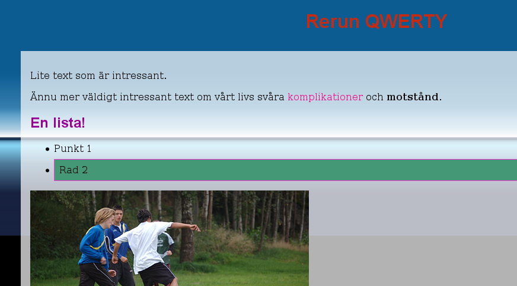
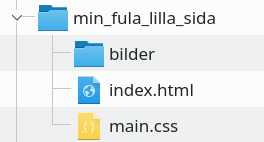

# Manual: Min Fula Lilla Sida

Det är inte lätt att vara nybörjare.
Alla webbutvecklare börjar från början, och det första de producerar brukar sällan se bra ut.
Så varför inte se till att få det ur systemet direkt? På så sätt kan vi sedan gå vidare och skapa snyggare grejer.
Denna uppgiften går ut på att du skall lära dig grunderna i webbutveckling, och samtidigt göra en riktigt ful liten sida.

---

---

## Förutsättningar

Enskild uppgift.

## Resurser
* [Valfri webbläsare](https://www.mozilla.org/sv-SE/firefox/new/)
* [Notepad++](https://notepad-plus-plus.org/)
* [7Zip](https://www.7-zip.org/)
* [HTML Dog](https://htmldog.com/)
  - [HTML Beginner](https://htmldog.com/guides/html/beginner/) och [CSS Beginner](https://htmldog.com/guides/css/beginner/)
  - [HTML Intermediate](https://htmldog.com/guides/html/intermediate/) och [CSS Intermediate](https://htmldog.com/guides/css/intermediate/)
  - [HTML Advanced](https://htmldog.com/guides/html/advanced/) och [CSS Advanced](https://htmldog.com/guides/css/advanced/)

> Tips! Om du kör Windows som OS kan mjukvarorna som nämns ovan installeras via den utmärkta tjänsten [Ninite](https://ninite.com/7zip-firefox-notepadplusplus/).

## Uppgiftsbeskrivning

Du skall nu skapa din första webbsida.

[HTML Dog](https://htmldog.com/) innehåller tre avsnitt om HTML och tre avsnitt om CSS. Du skall läsa dessa avsnitt, i ordning, och implementera majoriteten av det du lär dig i din Fula Lilla Sida. Testa de exempel som ges, pröva att ändra värden och ordningen på instruktionerna för att bli bekant med och få förståelse för hur språken fungerar.

Börja med att skapa en ny [katalog](https://sv.wikipedia.org/wiki/Katalog_(datorteknik)) på valfri plats i [filsystemet](https://sv.wikipedia.org/wiki/Filsystem). Skapa i denna en katalog som heter __bilder__, en fil som heter __index.html__ och en fil som heter __main.css__. Lägg sedan bilder du använder under projektets gång i underkatalogen bilder. Se Bild 2 för ett exempel av hur det kan se ut.

Den resulterande sidan får med fördel vara riktigt ful.

## Förväntat resultat

I slutet av den här uppgiften förväntas du ha skapat en ful liten sida bestående av minst ett html-dokument och minst ett css-dokument. Sidan skall innehålla alla de moment som återfinns i HTML- och CSS-delarna på HTML Dog.

### Vilka filer?

Skapa ett 7Zip-arkiv av din arbetskatalog.

### Var skall de lämnas in?

I inlämningskatalogen i Webbutveckling 1-rummet i It's.
