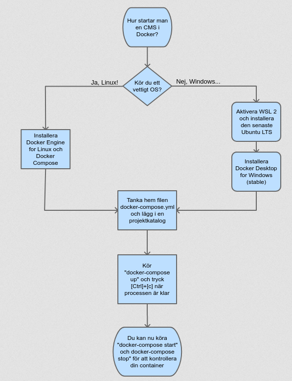

<header style="float:right;">
  
</header>

# Webbutveckling 2: Workspace setup

*Oavsett om du arbetar med webbutveckling eller annan mjukvaruutveckling så är det viktigt att du har en stabil utvecklingsmiljö. I detta fallet vill vi ha CMSen Drupal. Mjukvaran Docker fixar både en LAMP-stack och Drupal-installation genom containervirtualisering.*

## Förutsättningar

Individuell uppgift.

I denna uppgift krävs det att du kan läsa, förstå och följa officiella instruktioner för installation och konfigurering av mjukvara.

### Resurser
* [VirtualBox](https://www.virtualbox.org/)
* [WSL 2 (Ubuntu 20.04 LTS)](https://docs.microsoft.com/en-us/windows/wsl/install-win10)
* [Docker Desktop for Windows](https://docs.docker.com/docker-for-windows/install-windows-home/)
* [Docker Engine for Linux](https://docs.docker.com/engine/install/ubuntu/) och [Docker Compose](https://docs.docker.com/compose/install/)
* [docker-compose.yml (version 2.0)](https://raw.githubusercontent.com/seetee/docker/version2.0/drupal/docker-compose.yml)

> Tips! Börja med att skapa en ny katalog till varje utvecklingsmiljö, och lägg den någonstans där den är lätt att navigera till. Detta är centret i din utveckling!

## Uppgiftsbeskrivning

Målet med övningen är att ha en fungerande mjukvaruinfrastruktur där du kan sätta upp en utvecklingsmiljö med hjälp av docker-compose. För att kunna använda docker-compose behöver du tre mjukvaror: 1 hypervizor att skapa containrar i, en linux-miljö (riktig eller virtualiserad) samt Docker. Efter det skall du ladda hem docker-compose.yml-filen som innehåller "receptet" för hur din utvecklingsmiljö skall se ut. Slutför sedan installationen av Drupal i din webbläsare utifrån uppgifterna i docker-compose.yml-filen.

Du kommer inte behöva använda vare sig VirtualBox, Ubuntu eller Docker Desktop i den här övningen. Efter installationen räcker det att du kör CLI-kommandon i PowerShell för att aktivera din docker-compose.yml och köra dina dockercontainers.

I filen docker-compose.yml finns information om vilken lokal port din virtuella container kommer finnas på. Där finns även all information du behöver för att konfigurera databasen under det sista momentet i installationen av Drupal. När det gäller inställningar som inte nämns i instruktionen så kan du lämna dem som de är, eller hitta på egna kreativa alternativ.

> Tips! Varje gång du startar ett nytt projekt, redigera docker-compose.yml så alla containernamn och portar är unika på din host.

Följ instruktionen i flödesschemat nedan så du inte missar något steg eller gör något i fel ordning. Får du felmeddelanden, läs vad de säger och hur de föreslår att du löser problemet. Gå sedan tillbaka i instruktionerna så du kan vara 100% säker att du inte hoppat över något steg, eller råkat göra något i fel ordning.

--

När installationen är färdig, skapa en article och ett block. Publicera din article till förstasidan, och lägg in blocket på förstasidan. Dessa kan innehålla valfri kreativ copy.

&nbsp;

&nbsp;

## Förväntat resultat

En utvecklingsmiljö där du har en installerad instans av Drupal som körs i en egen docker-container.

### Vilka filer?

Ett screenshot av förstasidan av din färdiga Drupalinstallation, där man ser ditt block och din article.

### Var skall de lämnas in?

På vår lärplattform [It's Learning](https://stenungsund.itslearning.com/) finns ett kursrum med samma namn som den här kursen, under *Innehåll* / *Inlämningar* hittar du en inlämningskatalog med samma namn som den här uppgiften.

---

<footer style="columns: 2">
  
Detta dokument är licenserat under Creative Commons BY-SA. Bilder och fotografier tillhör respektive upphovsman, och befinner sig inte nödvändigtsvis under en Creative Commons-licens.

  
Dokumentet är skapat och uppdaterat av Kenneth Frantzen (@seetee på GitHub).

</footer>
